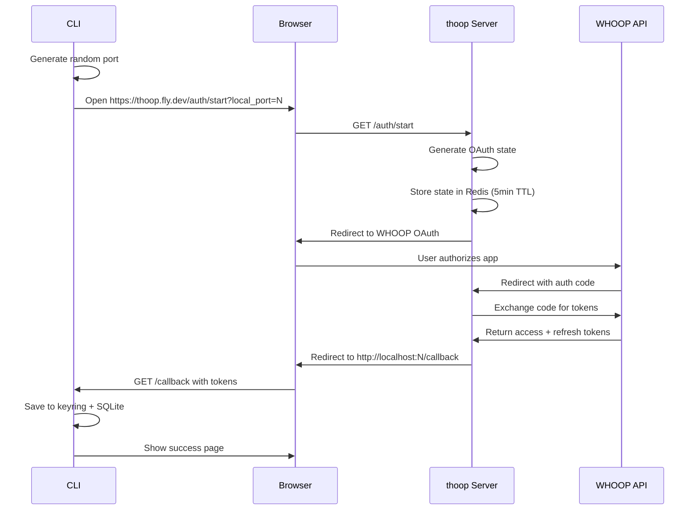

thoop uses **OAuth 2.0 Authorization Code flow** with PKCE to authenticate with the WHOOP API. The authentication is mediated by the companion server to protect the client secret.

## OAuth Flow Types

thoop supports two OAuth flow implementations:

### 1. Server Flow (Default)

The **server flow** is the default and recommended flow. It uses the companion server (`thoop.fly.dev`) as an OAuth proxy.



**Advantages:**
- Client secret protected on server
- Version compatibility checking
- Account status validation (banned users)
- Rate limiting during auth

**Implementation:**

The server flow is implemented in `internal/oauth/flow.go:54-79`:

```go
type ServerFlow struct {
    serverURL string
    querier   litesqlc.Querier
    keyring   keyring.Store
}

func (f *ServerFlow) Run(ctx context.Context) (*AuthResult, error) {
    return runFlow(ctx, f.querier, f.keyring, f.authURL, serverCallbackHandler)
}

func (f *ServerFlow) authURL(port string) string {
    return fmt.Sprintf("%s/auth/start?%s=%s&%s=%s",
        f.serverURL,
        ParamLocalPort, port,
        ParamClientVersion, url.QueryEscape(thoop.Version))
}
```

### 2. Direct Flow (Development)

The **direct flow** communicates directly with WHOOP's OAuth endpoints. This is primarily used during development or when the server is unavailable.

<Warning>
Direct flow requires client secret to be configured locally. It should not be used in production.
</Warning>

**Implementation:**

Direct flow is implemented in `internal/oauth/flow.go:81-138`:

```go
type DirectFlow struct {
    config  *oauth2.Config
    querier litesqlc.Querier
    keyring keyring.Store
    state   string
}

func (f *DirectFlow) Run(ctx context.Context) (*AuthResult, error) {
    return runFlow(ctx, f.querier, f.keyring, f.authURL, f.callbackHandler())
}
```

## OAuth Configuration

WHOOP OAuth configuration is defined in `internal/oauth/config.go:11-38`:

```go
const (
    authURL  = "https://api.prod.whoop.com/oauth/oauth2/auth"
    tokenURL = "https://api.prod.whoop.com/oauth/oauth2/token"
)

var scopes = []string{
    "offline",              // Refresh token
    "read:recovery",        // Recovery scores
    "read:cycles",          // Physiological cycles
    "read:sleep",           // Sleep data
    "read:workout",         // Workout data
    "read:profile",         // User profile
    "read:body_measurement", // Body measurements
}
```

<Info>
The `offline` scope is critical—it grants a refresh token for long-lived access without re-authentication.
</Info>

## State Parameter Security

OAuth state prevents CSRF attacks. thoop generates cryptographically secure random states:

**State Generation** (`internal/oauth/state.go:11-17`):

```go
func GenerateState() (string, error) {
    b := make([]byte, 32)
    if _, err := rand.Read(b); err != nil {
        return "", fmt.Errorf("failed to read random bytes: %w", err)
    }
    return base64.URLEncoding.EncodeToString(b), nil
}
```

**State Validation** (`internal/oauth/state.go:19-21`):

```go
func ValidateState(expected string, received string) bool {
    return expected != "" && expected == received
}
```

In the server flow, states are stored in Redis with a 5-minute TTL and deleted after use (see `internal/storage/redis.go`).

## Token Storage

Tokens are stored securely using a **dual-storage approach**:

### Keyring (Secrets)

Sensitive token values are stored in the OS keyring:

- `thoop.access_token`: WHOOP access token (JWT)
- `thoop.refresh_token`: WHOOP refresh token
- `thoop.api_key`: thoop server API key

**Token Save** (`internal/oauth/flow.go:282-314`):

```go
func saveToken(ctx context.Context, querier litesqlc.Querier, kr keyring.Store, 
               token *oauth2.Token, apiKey string) error {
    if err := kr.Set(keyring.KeyAccessToken, token.AccessToken); err != nil {
        return fmt.Errorf("failed to save access token to keyring: %w", err)
    }

    if token.RefreshToken != "" {
        if err := kr.Set(keyring.KeyRefreshToken, token.RefreshToken); err != nil {
            return fmt.Errorf("failed to save refresh token to keyring: %w", err)
        }
    }

    if apiKey != "" {
        if err := kr.Set(keyring.KeyAPIKey, apiKey); err != nil {
            return fmt.Errorf("failed to save API key to keyring: %w", err)
        }
    }
    
    // Save metadata to SQLite (see below)
    // ...
}
```

### SQLite (Metadata)

Non-sensitive metadata is stored in SQLite:

- `token_type`: "Bearer"
- `expiry`: Token expiration timestamp

This allows checking expiration without accessing the keyring.

## Token Refresh

Tokens are automatically refreshed when expired. The `DBTokenSource` handles this transparently:

**Token Source** (`internal/oauth/token.go:29-85`):

```go
type DBTokenSource struct {
    config  *oauth2.Config
    querier litesqlc.Querier
    keyring keyring.Store
    mu      sync.Mutex
    token   *oauth2.Token
}

func (s *DBTokenSource) Token() (*oauth2.Token, error) {
    s.mu.Lock()
    defer s.mu.Unlock()

    // Return cached token if valid
    if s.token != nil && s.token.Valid() {
        return s.token, nil
    }

    ctx, cancel := context.WithTimeout(context.Background(), 5*time.Second)
    defer cancel()

    // Load from storage
    token, err := s.loadCredentials(ctx)
    if err != nil {
        return nil, err
    }

    // If still valid, cache and return
    if token.Valid() {
        s.token = token
        return token, nil
    }

    // Refresh if we have a refresh token
    if token.RefreshToken == "" {
        return nil, ErrTokenExpired
    }

    src := s.config.TokenSource(ctx, token)
    newToken, err := src.Token()
    if err != nil {
        return nil, fmt.Errorf("failed to refresh token: %w", err)
    }

    // Save refreshed token
    if err := s.saveCredentials(ctx, newToken); err != nil {
        return nil, fmt.Errorf("failed to save refreshed token: %w", err)
    }

    s.token = newToken
    return newToken, nil
}
```

<Note>
Token refresh is thread-safe via mutex. Multiple concurrent requests won't cause duplicate refresh attempts.
</Note>

## Server-Side Authentication

The server validates requests using a two-tier authentication system:

1. **API Key Header** (`X-API-Key`): Identifies the user account
2. **Bearer Token** (`Authorization: Bearer <token>`): Proves user owns the WHOOP account

See the [Server Architecture](/architecture/server) page for details on how the server validates these.

## Error Handling

The OAuth flow handles several error scenarios:

### Version Incompatibility

Server checks CLI version and rejects outdated clients:

```go
if ErrorCode(errParam) == ErrorCodeIncompatibleVersion {
    _ = xtempl.Render(w, r, templates.VersionError(errDesc))
    fmt.Fprintf(os.Stderr, "\nVersion incompatibility: %s\n", errDesc)
    fmt.Fprintf(os.Stderr, "Please upgrade: thoop upgrade\n\n")
    return nil, "", fmt.Errorf("version incompatibility: %s", errDesc)
}
```

### Account Banned

Server detects banned accounts and rejects authentication:

```go
if ErrorCode(errParam) == ErrorCodeAccountBanned {
    _ = xtempl.Render(w, r, templates.AccountBanned())
    fmt.Fprintf(os.Stderr, "\nAccount banned: %s\n", errDesc)
    return nil, "", fmt.Errorf("account banned: %s", errDesc)
}
```

### Rate Limited

During auth, server may rate-limit new authentications:

```go
if ErrorCode(errParam) == ErrorCodeRateLimited {
    _ = xtempl.Render(w, r, templates.RateLimited())
    fmt.Fprintf(os.Stderr, "\nRate limited: %s\n", errDesc)
    return nil, "", fmt.Errorf("rate limited: %s", errDesc)
}
```

## Security Best Practices

<CardGroup cols={2}>
  <Card title="Client Secret Protection" icon="shield">
    OAuth client secret is never exposed in CLI binary. It lives only on the server.
  </Card>
  <Card title="Keyring Storage" icon="key">
    Tokens stored in OS-native secure storage (Keychain, Credential Manager, Secret Service).
  </Card>
  <Card title="State CSRF Protection" icon="lock">
    32-byte cryptographically random state prevents OAuth CSRF attacks.
  </Card>
  <Card title="Short-lived States" icon="clock">
    OAuth states expire after 5 minutes in Redis, preventing replay attacks.
  </Card>
</CardGroup>

## Next Steps

- [Caching](/architecture/caching) - Learn how tokens are cached for performance
- [Server](/architecture/server) - See how the server validates authentication
- [Rate Limiting](/architecture/rate-limiting) - Understand how rate limits protect the OAuth endpoints