thoop uses a **multi-tier caching strategy** to minimize API calls, reduce latency, and provide offline access. The caching system intelligently determines when data is stale based on WHOOP's scoring lifecycle.

## Cache Tiers

thoop employs three cache layers:

```mermaid
graph LR
    CLI[CLI Client]
    SQLite[(SQLite Cache)]
    Redis[(Redis Cache)]
    Server[Server]
    WHOOP[WHOOP API]
    
    CLI -->|1. Check Local| SQLite
    CLI -->|2. If Miss/Stale| Server
    Server -->|3. Check Token| Redis
    Server -->|4. If Miss| WHOOP
    WHOOP -->|5. Response| Server
    Server -->|6. Cache Token| Redis
    Server -->|7. Return Data| CLI
    CLI -->|8. Update Cache| SQLite
    
    style SQLite fill:#a8dadc
    style Redis fill:#e63946
    style Server fill:#457b9d
    style WHOOP fill:#1d3557
```



### 1. SQLite (CLI Local Cache)

The CLI maintains a local SQLite database to cache WHOOP data:

- **Location**: `~/.local/share/thoop/thoop.db` (Linux/macOS) or `%APPDATA%\thoop\thoop.db` (Windows)
- **Schema**: Cycles, recoveries, sleep, workouts with timestamps
- **Purpose**: Fast local access, offline viewing, reduce API calls
- **Staleness**: Intelligent refresh based on score state (see below)

### 2. Redis (Server Token Cache)

The server caches validated bearer tokens in Redis:

- **Key Pattern**: `whoop:token:user:<sha256(token)>`
- **Value**: WHOOP user ID (int64)
- **TTL**: Matches token expiry
- **Purpose**: Avoid repeated token validation API calls

**Implementation** (`internal/storage/token_cache_redis.go:13-43`):

```go
const tokenCacheKeyPrefix = "whoop:token:user:"

type RedisTokenCache struct {
    client *redis.Client
}

func (c *RedisTokenCache) GetUserID(ctx context.Context, tokenHash string) (int64, error) {
    userIDStr, err := c.client.Get(ctx, tokenCacheKeyPrefix+tokenHash).Result()
    if errors.Is(err, redis.Nil) {
        return 0, ErrNotFound
    }
    if err != nil {
        return 0, fmt.Errorf("failed to get user id from cache: %w", err)
    }
    userID, err := strconv.ParseInt(userIDStr, 10, 64)
    if err != nil {
        return 0, fmt.Errorf("failed to parse user id: %w", err)
    }
    return userID, nil
}

func (c *RedisTokenCache) SetUserID(ctx context.Context, tokenHash string, 
                                    userID int64, ttl time.Duration) error {
    if err := c.client.Set(ctx, tokenCacheKeyPrefix+tokenHash, 
                           strconv.FormatInt(userID, 10), ttl).Err(); err != nil {
        return fmt.Errorf("failed to set user id in cache: %w", err)
    }
    return nil
}
```

### 3. Redis (Server Rate Limit State)

The server also caches rate limit counters in Redis. See [Rate Limiting](/architecture/rate-limiting) for details.

## Cache Service

The cache service (`internal/cache/service.go`) provides a unified interface for data access. It abstracts caching decisions from the CLI.

**Interface** (`internal/cache/cache.go:10-33`):

```go
type CacheService interface {
    // Single-date operations
    GetCycleForDate(ctx context.Context, date time.Time) (*CacheResult[*whoop.Cycle], error)
    GetRecoveryForCycle(ctx context.Context, cycleID int64) (*CacheResult[*whoop.Recovery], error)
    GetSleepForCycle(ctx context.Context, cycleID int64) (*CacheResult[*whoop.Sleep], error)
    GetWorkoutsForDateRange(ctx context.Context, start, end time.Time) (*CacheResult[[]whoop.Workout], error)

    // Range operations (for charts, historical data)
    GetCyclesForRange(ctx context.Context, start, end time.Time) (*DateRangeResult[whoop.Cycle], error)
    GetRecoveriesForRange(ctx context.Context, start, end time.Time) (*DateRangeResult[whoop.Recovery], error)
    GetSleepsForRange(ctx context.Context, start, end time.Time) (*DateRangeResult[whoop.Sleep], error)

    // Calendar-specific (fetches recoveries and cycles for proper date mapping)
    GetCalendarData(ctx context.Context, month time.Time) (*CalendarData, error)

    // Historical bundle (30-day data for charts)
    GetHistoricalData(ctx context.Context, referenceDate time.Time, days int) (*HistoricalData, error)
}
```

## Staleness Detection

thoop uses **score state-based staleness** to intelligently refresh data. WHOOP data goes through a lifecycle:

1. **PENDING_SCORE**: Data collected, awaiting scoring (e.g., recovery just after waking)
2. **SCORED**: Data processed and scored
3. **UNSCORABLE**: Data that won't be scored (e.g., incomplete cycle)

### Staleness Rules

**Implementation** (`internal/cache/staleness.go:16-62`):

```go
type DefaultStalenessChecker struct {
    pendingRefreshInterval  time.Duration // 5 minutes
    todayScoredRefreshAfter time.Duration // 15 minutes
    historicalRefreshAfter  time.Duration // 24 hours
}

func (c *DefaultStalenessChecker) ShouldRefresh(scoreState whoop.ScoreState, 
                                                 dataDate, fetchedAt time.Time) bool {
    now := time.Now()
    age := now.Sub(fetchedAt)

    switch scoreState {
    case whoop.ScoreStateUnscorable:
        // Unscorable data never changes
        return false

    case whoop.ScoreStatePendingScore:
        // Pending data might be scored soon, check frequently
        return age > c.pendingRefreshInterval // 5 minutes

    case whoop.ScoreStateScored:
        // Scored data is stable, but today's data might still update
        if xtime.SameDay(dataDate, now) {
            return age > c.todayScoredRefreshAfter // 15 minutes
        }
        // Historical scored data is very stable
        return age > c.historicalRefreshAfter // 24 hours

    default:
        // Unknown state, assume stale
        return true
    }
}
```

<Info>
**Why these intervals?**
- **Pending (5 min)**: WHOOP usually scores data within minutes of completion
- **Today's scored (15 min)**: Current day data may receive updates (e.g., new workouts)
- **Historical (24 hours)**: Past data rarely changes once scored
</Info>

## Cache-First Pattern

All cache operations follow a **cache-first** pattern:

**Example: Get Cycle for Date** (`internal/cache/service.go:48-93`):

```go
func (s *Service) GetCycleForDate(ctx context.Context, date time.Time) (*CacheResult[*whoop.Cycle], error) {
    // 1. Try cache first
    if s.repo != nil {
        cached, err := s.repo.Cycles.GetByDate(ctx, date)
        if err == nil && cached != nil {
            // Check staleness based on score state and time
            if !s.stalenessChecker.ShouldRefresh(cached.ScoreState, cached.Start, cached.UpdatedAt) {
                return &CacheResult[*whoop.Cycle]{Data: cached, FromCache: true}, nil
            }
        }
    }

    // 2. Cache miss or stale - fetch from API
    if s.client == nil {
        return &CacheResult[*whoop.Cycle]{Data: nil, FromCache: false}, nil
    }

    ctx, cancel := context.WithTimeout(ctx, 5*time.Second)
    defer cancel()

    start := xtime.StartOfDay(date)
    end := start.Add(24 * time.Hour)

    cycles, err := s.client.Cycle.List(ctx, &whoop.ListParams{
        Limit: 1,
        Start: &start,
        End:   &end,
    })
    if err != nil {
        return nil, fmt.Errorf("list cycles: %w", err)
    }

    if len(cycles.Records) == 0 {
        return &CacheResult[*whoop.Cycle]{Data: nil, FromCache: false}, nil
    }

    cycle := &cycles.Records[0]

    // 3. Store to cache for future use
    if s.repo != nil {
        _ = s.repo.Cycles.Upsert(ctx, cycle)
    }

    return &CacheResult[*whoop.Cycle]{Data: cycle, FromCache: false}, nil
}
```

## Coverage-Based Fetching

For date ranges (e.g., calendar view), thoop uses **coverage-based fetching** to minimize API calls.

**Example: Calendar Data** (`internal/cache/service.go:212-322`):

```go
func (s *Service) GetCalendarData(ctx context.Context, month time.Time) (*CalendarData, error) {
    startOfMonth := time.Date(month.Year(), month.Month(), 1, 0, 0, 0, 0, month.Location())
    endOfMonth := startOfMonth.AddDate(0, 1, 0)

    // 1. Check cache for existing data
    cachedRecoveries, cachedCycles, cachedDates := s.loadCalendarCache(ctx, startOfMonth, endOfMonth)

    // 2. Find missing date ranges
    missingRanges := s.findMissingRanges(startOfMonth, endOfMonth, cachedDates)

    // 3. Fetch missing data from API (if any)
    if len(missingRanges) > 0 && s.client != nil {
        // Fetch only missing ranges, not entire month
        // ...
    }

    // 4. Merge cached and fetched data
    allRecoveries := MergeRecoverySlices(cachedRecoveries, fetchedRecoveries)
    allCycles := MergeCycleSlices(cachedCycles, fetchedCycles)

    return &CalendarData{
        Recoveries: allRecoveries,
        Cycles:     allCycles,
        FromCache:  len(fetchedRecoveries) == 0,
    }, nil
}
```

**Missing Range Detection** (`internal/cache/service.go:669-696`):

```go
func (s *Service) findMissingRanges(start, end time.Time, 
                                     cachedDates map[string]bool) []dateRange {
    if len(cachedDates) == 0 {
        return []dateRange{{start: start, end: end}}
    }

    var ranges []dateRange
    var rangeStart *time.Time

    for d := start; d.Before(end); d = d.AddDate(0, 0, 1) {
        dateKey := d.Format("2006-01-02")
        isCached := cachedDates[dateKey]

        if !isCached && rangeStart == nil {
            t := d
            rangeStart = &t
        } else if isCached && rangeStart != nil {
            ranges = append(ranges, dateRange{start: *rangeStart, end: d})
            rangeStart = nil
        }
    }

    if rangeStart != nil {
        ranges = append(ranges, dateRange{start: *rangeStart, end: end})
    }

    return ranges
}
```

<Note>
If you have data cached for Feb 1-15 and Feb 20-28, requesting the full month will only fetch Feb 16-19 from the API.
</Note>

## Historical Data Optimization

For charts requiring 30+ days of data, thoop uses **parallel fetching** to speed up cold cache scenarios:

**Implementation** (`internal/cache/service.go:375-483`):

```go
func (s *Service) GetHistoricalData(ctx context.Context, referenceDate time.Time, 
                                     days int) (*HistoricalData, error) {
    // Load cached data
    cachedCycles, cachedRecoveries, cachedSleeps := s.loadHistoricalCache(ctx, startDate, endOfDay)

    // Check if all cached data is fresh
    allFresh := len(cachedCycles) > 0
    for _, c := range cachedCycles {
        if s.stalenessChecker.ShouldRefresh(c.ScoreState, c.Start, c.UpdatedAt) {
            allFresh = false
            break
        }
    }
    // ... (check recoveries and sleeps)

    // If we have sufficient fresh data, use cache
    minDaysRequired := max(7, days/4) // at least 7 days or 25% of requested days
    if allFresh && len(cachedCycles) >= minDaysRequired {
        return &HistoricalData{ /* ... */ }, nil
    }

    // Fetch from API in parallel
    var wg sync.WaitGroup
    wg.Add(2)

    go func() {
        defer wg.Done()
        // Fetch cycles with pagination
        // ...
    }()

    go func() {
        defer wg.Done()
        // Fetch sleeps with pagination
        // ...
    }()

    // Fetch recoveries in main goroutine
    // ...

    wg.Wait()

    // Store all fetched data to SQLite
    if s.repo != nil {
        _ = s.repo.Cycles.UpsertBatch(ctx, allCycles)
        _ = s.repo.Sleeps.UpsertBatch(ctx, allSleeps)
        _ = s.repo.Recoveries.UpsertBatch(ctx, allRecoveries)
    }

    return &HistoricalData{ /* ... */ }, nil
}
```

## Cache Invalidation

Caches are invalidated via:

1. **Staleness checks**: Automatic refresh based on score state (see above)
2. **Webhooks**: Server notifies CLI of new data via SSE
3. **Manual refresh**: User triggers refresh in UI
4. **Upsert strategy**: New API data overwrites cached entries

### Webhook-Triggered Invalidation

When WHOOP sends a webhook (e.g., "recovery.updated"), the server:

1. Validates webhook signature
2. Stores event in PostgreSQL
3. Broadcasts via Redis pub/sub
4. CLI receives SSE notification
5. CLI marks relevant cache entries as stale
6. Next UI refresh fetches new data

See [Server Architecture](/architecture/server) for webhook implementation details.

## Performance Benefits

<CardGroup cols={2}>
  <Card title="Reduced Latency" icon="bolt">
    SQLite cache provides sub-millisecond response times vs. 200-500ms API calls.
  </Card>
  <Card title="Offline Access" icon="wifi">
    Cached data viewable without internet connection.
  </Card>
  <Card title="API Quota Savings" icon="chart-line">
    80%+ cache hit rate reduces API calls, preserving rate limit quota.
  </Card>
  <Card title="Battery Efficiency" icon="battery-full">
    Fewer network requests save battery on mobile hotspots.
  </Card>
</CardGroup>

## Next Steps

- [Rate Limiting](/architecture/rate-limiting) - See how caching helps respect rate limits
- [Server](/architecture/server) - Learn how the server uses Redis caching
- [Authentication](/architecture/authentication) - Understand token caching