thoop is architected as a distributed system with two main components working together: the **CLI client** and a **companion server**. This design enables OAuth authentication, efficient data caching, and respects WHOOP's API rate limits across all users.

## System Components

```mermaid
graph TB
    CLI[thoop CLI]
    Server[thoop Server]
    WHOOP[WHOOP API]
    Redis[(Redis Cache)]
    Postgres[(PostgreSQL)]
    SQLite[(SQLite - Local)]
    
    CLI -->|OAuth Flow| Server
    CLI -->|API Requests| Server
    CLI -->|Local Cache| SQLite
    Server -->|Proxied Requests| WHOOP
    Server -->|Rate Limiting| Redis
    Server -->|User Data| Postgres
    Server -->|Token Cache| Redis
    Server -->|Pub/Sub| Redis
    
    style CLI fill:#a8dadc
    style Server fill:#457b9d
    style WHOOP fill:#1d3557
    style Redis fill:#e63946
    style Postgres fill:#f1faee
    style SQLite fill:#a8dadc
```

## CLI Client

The CLI client is a Go application that runs locally on the user's machine. It provides:

- **Terminal UI (TUI)**: Interactive interface built with [Bubble Tea](https://github.com/charmbracelet/bubbletea)
- **Local SQLite cache**: Stores WHOOP data locally for fast access and offline viewing
- **OAuth client**: Handles authentication flow via the companion server
- **Keyring integration**: Securely stores access tokens using OS keyring (Keychain on macOS, etc.)

<Note>
The CLI stores sensitive credentials in the OS keyring, not in plain text files. Token metadata (expiry, type) is stored in SQLite, but the actual access/refresh tokens are secured in the keyring.
</Note>

## Companion Server

The companion server (`thoop.fly.dev`) is a Go HTTP server deployed on Fly.io. It serves multiple critical functions:

### Why a Server?

The server exists for three main reasons:

1. **OAuth Secret Protection**: The WHOOP OAuth client secret must remain confidential. A CLI can't securely store secrets (they'd be in the binary). The server proxies OAuth exchanges.

2. **Global Rate Limiting**: WHOOP enforces app-wide rate limits (100 requests/minute, 10,000/day across ALL users). The server coordinates these limits using Redis.

3. **Webhooks & Real-time Updates**: WHOOP sends webhooks when new data is available. The server receives these and broadcasts them via Server-Sent Events (SSE) to connected CLI clients.

### Server Responsibilities

The server handles:

- **OAuth proxy** for secure authentication (see [Authentication](/architecture/authentication))
- **WHOOP API proxy** with rate limiting (see [Rate Limiting](/architecture/rate-limiting))
- **Token validation** and caching (see [Caching](/architecture/caching))
- **Webhook ingestion** from WHOOP
- **SSE streaming** to notify clients of new data
- **User management** and API key generation

Refer to [Server Architecture](/architecture/server) for implementation details.

## Data Flow

### Initial Authentication

1. User runs `thoop` CLI for the first time
2. CLI opens browser to `thoop.fly.dev/auth/start`
3. Server redirects to WHOOP OAuth consent screen
4. User authorizes the app
5. WHOOP redirects back to server with auth code
6. Server exchanges code for access token + refresh token
7. Server redirects to CLI's local callback server (localhost)
8. CLI saves tokens to OS keyring and metadata to SQLite

### Data Fetching

1. CLI checks local SQLite cache for data
2. If cache miss or stale, CLI sends authenticated request to server
3. Server validates bearer token (cached in Redis)
4. Server checks rate limits (per-user and global)
5. If allowed, server proxies request to WHOOP API
6. Server updates rate limit counters from WHOOP response headers
7. Server returns data to CLI
8. CLI updates local SQLite cache

### Real-time Updates

1. WHOOP sends webhook to server when new data available (e.g., recovery scored)
2. Server validates webhook signature
3. Server stores event in PostgreSQL
4. Server broadcasts event via Redis pub/sub
5. Connected CLI clients receive SSE notification
6. CLI refreshes stale data from cache or server

## Technology Stack

### CLI
- **Language**: Go 1.23+
- **UI Framework**: [Bubble Tea](https://github.com/charmbracelet/bubbletea) + [Lip Gloss](https://github.com/charmbracelet/lipgloss)
- **Local Storage**: SQLite 3 via [modernc.org/sqlite](https://pkg.go.dev/modernc.org/sqlite)
- **Keyring**: OS native (macOS Keychain, Windows Credential Manager, Linux Secret Service)

### Server
- **Language**: Go 1.23+
- **HTTP Server**: Standard library `net/http`
- **Database**: PostgreSQL (user data, webhooks)
- **Cache**: Redis 7+ (rate limiting, token cache, pub/sub)
- **Deployment**: [Fly.io](https://fly.io) (global edge deployment)

## Security Considerations

<Warning>
thoop handles sensitive health data and OAuth credentials. The architecture includes several security measures:
</Warning>

- **OAuth secret protection**: Client secret never exposed in CLI binary
- **Credential storage**: Access tokens stored in OS keyring, never in files
- **Token transmission**: All communication over HTTPS/TLS
- **Webhook validation**: HMAC signature verification for all incoming webhooks
- **Rate limiting**: Prevents abuse and respects WHOOP's quotas
- **API key authentication**: Server-generated API keys for CLI-to-server auth

## Deployment Architecture

The server runs on Fly.io with:
- **Multiple regions**: Deployed globally for low latency
- **Autoscaling**: Scales based on request volume
- **Managed PostgreSQL**: Fly Postgres cluster with automatic backups
- **Upstash Redis**: Serverless Redis for rate limiting and caching
- **Zero-downtime deploys**: Rolling deployments with health checks

## Next Steps

<CardGroup cols={2}>
  <Card title="Authentication" icon="lock" href="/architecture/authentication">
    Learn how OAuth flow works with the WHOOP API
  </Card>
  <Card title="Caching" icon="database" href="/architecture/caching">
    Understand the caching strategy and staleness detection
  </Card>
  <Card title="Rate Limiting" icon="gauge" href="/architecture/rate-limiting">
    See how global and per-user rate limits are enforced
  </Card>
  <Card title="Server" icon="server" href="/architecture/server">
    Explore the companion server implementation
  </Card>
</CardGroup>