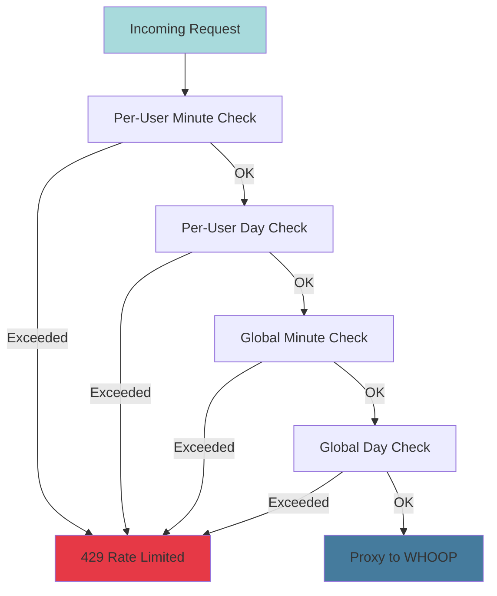

thoop implements a **sophisticated multi-tier rate limiting system** to respect WHOOP's API quotas across all users while maximizing throughput. The system uses Redis with Lua scripting for atomic operations.

## WHOOP API Limits

WHOOP enforces the following API rate limits:

- **Global Minute Limit**: 100 requests/minute (shared across ALL app users)
- **Global Day Limit**: 10,000 requests/day (shared across ALL app users)

These are **app-wide quotas**, not per-user. With hundreds of users, coordinating these limits is critical.

<Warning>
Exceeding WHOOP's rate limits can result in temporary API access suspension or permanent app ban.
</Warning>

## thoop's Rate Limiting Strategy

thoop adds **per-user limits** on top of WHOOP's global limits to ensure fair access:

- **Per-User Day Limit**: 1,000 requests/day (prevents single user from exhausting quota)
- **Dynamic Per-User Minute Limit**: Calculated based on active users (see below)

### Rate Limit Tiers



## Dynamic Per-User Minute Limit

The **per-user minute limit is dynamically calculated** based on the number of active users:

```
dynamicLimit = max(
    (globalMinuteLimit - reserveBuffer) / activeUserCount,
    minPerUserMinuteLimit
)
```

**Parameters** (from `cmd/server/main.go:213-221`):

```go
whoopCfg := storage.WhoopRateLimiterConfig{
    PerUserDayLimit:       1000,  // requests/day per user
    GlobalMinuteLimit:     95,    // global requests/minute (buffer below 100)
    GlobalDayLimit:        9950,  // global requests/day (buffer below 10,000)
    ReserveBuffer:         5,     // reserve for new users
    MinPerUserMinuteLimit: 5,     // minimum per user (floor)
    ActiveWindowSeconds:   60,    // window to consider user "active"
}
```

**Example calculations:**

- **1 active user**: `(95 - 5) / 1 = 90` requests/minute
- **5 active users**: `(95 - 5) / 5 = 18` requests/minute
- **20 active users**: `(95 - 5) / 20 = 4.5` → clamped to `5` (floor)

<Info>
The dynamic limit ensures fair distribution while protecting against quota exhaustion. New users joining mid-minute get their share from the reserve buffer.
</Info>

## Redis Implementation

Rate limiting uses **Redis sorted sets** with sliding windows. Each request is a sorted set member scored by timestamp.

### Redis Keys

**Implementation** (`internal/storage/whoop_redis.go:20-24`):

```go
const (
    whoopUserKeyPrefix   = "whoop:ratelimit:user:"   // per-user counters
    whoopGlobalKeyPrefix = "whoop:ratelimit:global"  // global counters
    whoopActiveUsersKey  = "whoop:ratelimit:active_users" // active user tracking
)
```

**Key Examples:**
- `whoop:ratelimit:user:12345:minute` - User 12345's minute window
- `whoop:ratelimit:user:12345:day` - User 12345's day window
- `whoop:ratelimit:global:minute` - Global minute window
- `whoop:ratelimit:global:day` - Global day window
- `whoop:ratelimit:active_users` - Sorted set of active users

### Lua Script (Atomic Check-and-Increment)

The rate limit check is **atomic** via a Lua script (`internal/storage/whoop_ratelimit.lua`):

**Script execution** (`internal/storage/whoop_redis.go:76-125`):

```go
func (w *WhoopRedisLimiter) CheckAndIncrement(ctx context.Context, 
                                               userKey string) (*WhoopRateLimitState, error) {
    keys := []string{
        whoopUserKeyPrefix + userKey + ":minute",
        whoopUserKeyPrefix + userKey + ":day",
        whoopGlobalKeyPrefix + ":minute",
        whoopGlobalKeyPrefix + ":day",
        whoopActiveUsersKey,
    }

    params := rateLimitScriptParams{
        perUserDayLimit:       w.config.PerUserDayLimit,       // 1000
        globalMinuteLimit:     w.config.GlobalMinuteLimit,     // 95
        globalDayLimit:        w.config.GlobalDayLimit,        // 9950
        minuteWindowMs:        60_000,                         // 1 minute
        dayWindowMs:           86_400_000,                     // 24 hours
        ttlSeconds:            90_000,                         // 25 hours
        reserveBuffer:         w.config.ReserveBuffer,         // 5
        minPerUserMinuteLimit: w.config.MinPerUserMinuteLimit, // 5
        activeWindowMs:        w.config.ActiveWindowSeconds * 1000, // 60s
        userID:                userKey,
    }

    result, err := whoopRateLimitScript.Run(ctx, w.client, keys, params.args()...).Result()
    // Parse result...
}
```

**The Lua script:**
1. Removes expired entries from all windows
2. Counts current usage in each window
3. Calculates dynamic per-user minute limit
4. Checks all four limits (user minute/day, global minute/day)
5. If all pass: increments counters and returns "allowed"
6. If any fail: returns "denied" with reason

<Note>
Lua scripts execute atomically on the Redis server, preventing race conditions even with thousands of concurrent requests.
</Note>

## Rate Limit State

The rate limiter returns detailed state information:

**State structure** (`internal/storage/storage.go:44-62`):

```go
type WhoopRateLimitState struct {
    Allowed            bool                 // Request allowed?
    MinuteRemaining    int                  // Requests left in minute window
    MinuteReset        time.Time            // When minute window resets
    DayRemaining       int                  // Requests left in day window
    DayReset           time.Time            // When day window resets
    Reason             *WhoopRateLimitReason // Why denied (if Allowed=false)
    DynamicMinuteLimit int                  // Calculated minute limit for this user
    ActiveUserCount    int                  // Current active user count
}
```

**Denial reasons** (`internal/storage/storage.go:44-51`):

```go
type WhoopRateLimitReason string

const (
    WhoopRateLimitReasonPerUserMinute WhoopRateLimitReason = "per-user-minute"
    WhoopRateLimitReasonPerUserDay    WhoopRateLimitReason = "per-user-day"
    WhoopRateLimitReasonGlobalMinute  WhoopRateLimitReason = "global-minute"
    WhoopRateLimitReasonGlobalDay     WhoopRateLimitReason = "global-day"
)
```

## Proxy Service Integration

The proxy service uses the rate limiter before proxying to WHOOP:

**Proxy check** (`internal/service/proxy/proxy.go:42-96`):

```go
func (p *Proxy) CheckRateLimit(ctx context.Context, userID int64) (*RateLimitInfo, error) {
    userKey := strconv.FormatInt(userID, 10)

    state, err := p.whoopLimiter.CheckAndIncrement(ctx, userKey)
    if err != nil {
        return nil, fmt.Errorf("checking rate limit: %w", err)
    }

    if state.Allowed {
        return nil, nil // Request allowed
    }

    // Request denied - determine retry-after and message
    var (
        retryAfter time.Duration
        message    string
        reason     string
    )

    if state.Reason != nil {
        reason = string(*state.Reason)

        switch *state.Reason {
        case storage.WhoopRateLimitReasonPerUserMinute:
            retryAfter = time.Until(state.MinuteReset)
            message = fmt.Sprintf("Per-user rate limit exceeded (%d requests/minute)", 
                                  state.DynamicMinuteLimit)
        case storage.WhoopRateLimitReasonPerUserDay:
            retryAfter = time.Until(state.DayReset)
            message = fmt.Sprintf("Per-user rate limit exceeded (%d requests/day)", 
                                  p.rateLimitCfg.PerUserDayLimit)
        case storage.WhoopRateLimitReasonGlobalMinute:
            retryAfter = time.Until(state.MinuteReset)
            message = "Global rate limit exceeded (app quota exhausted for this minute)"
        case storage.WhoopRateLimitReasonGlobalDay:
            retryAfter = time.Until(state.DayReset)
            message = "Global rate limit exceeded (app quota exhausted for today)"
        default:
            retryAfter = time.Minute
            message = "Rate limit exceeded"
        }
    }

    return &RateLimitInfo{
        RetryAfter: retryAfter,
        Reason:     reason,
        Message:    message,
    }, ErrRateLimited
}
```

## Syncing with WHOOP's Headers

WHOOP includes rate limit info in response headers. thoop syncs its local state:

**Header parsing** (from `internal/client/whoop` package):

```
X-RateLimit-Limit: 100        # Limit (100 or 10000)
X-RateLimit-Remaining: 73     # Remaining in window
X-RateLimit-Reset: 42         # Seconds until reset
```

**Update from headers** (`internal/storage/whoop_redis.go:182-235`):

```go
func (w *WhoopRedisLimiter) UpdateFromHeaders(ctx context.Context, 
                                               headers http.Header) error {
    info, err := whoop.ParseRateLimitHeaders(headers)
    if err != nil {
        return fmt.Errorf("failed to parse rate limit headers: %w", err)
    }
    if info == nil {
        return nil
    }

    // Determine which window based on limit value
    // WHOOP returns either 100 (minute) or 10000 (day)
    var key string
    switch info.Limit {
    case 100:
        key = whoopGlobalKeyPrefix + ":minute"
    case 10_000:
        key = whoopGlobalKeyPrefix + ":day"
    default:
        return nil
    }

    used := info.Limit - info.Remaining

    // Clear existing entries and set new ones based on WHOOP's count
    // This syncs our local state with WHOOP's actual state
    pipe := w.client.Pipeline()
    pipe.Del(ctx, key)

    // Add 'used' number of entries with current timestamp
    for i := range used {
        member := fmt.Sprintf("%d:%d", now, i)
        pipe.ZAdd(ctx, key, redis.Z{Score: float64(now), Member: member})
    }

    // Set expiration based on reset duration
    ttl := info.Reset + time.Minute // add margin
    if ttl > 0 {
        pipe.Expire(ctx, key, ttl)
    }

    _, err = pipe.Exec(ctx)
    return err
}
```

<Info>
Syncing with WHOOP's headers prevents drift between thoop's counters and WHOOP's actual quota consumption.
</Info>

## Active User Tracking

The system tracks "active users" (users making requests in the last 60 seconds) to calculate dynamic limits:

**Active user sorted set:**
- **Key**: `whoop:ratelimit:active_users`
- **Score**: Timestamp of last request
- **Member**: User ID

The Lua script:
1. Removes users inactive for >60 seconds
2. Adds/updates current user's timestamp
3. Counts remaining users
4. Uses count to calculate dynamic limit

## HTTP Response Format

When rate limited, the server returns:

**HTTP 429 Too Many Requests**

```json
{
  "error": "rate_limited",
  "message": "Per-user rate limit exceeded (18 requests/minute)",
  "reason": "per-user-minute",
  "retry_after_seconds": 42
}
```

**Headers:**

```
Retry-After: 42
X-RateLimit-Limit: 18
X-RateLimit-Remaining: 0
X-RateLimit-Reset: 42
```

## CLI Behavior

When the CLI receives a 429 response:

1. Displays error to user with countdown timer
2. Automatically retries after `Retry-After` duration
3. Uses exponential backoff for repeated rate limits
4. Falls back to cached data if available

## Statistics Endpoints

The server provides rate limit statistics (admin only):

**User stats** (`internal/storage/whoop_redis.go:237-265`):

```go
func (w *WhoopRedisLimiter) GetUserStats(ctx context.Context, 
                                          userKey string) (*UserRateLimitStats, error) {
    minKey := whoopUserKeyPrefix + userKey + ":minute"
    dayKey := whoopUserKeyPrefix + userKey + ":day"

    // Remove expired entries and count remaining
    pipe := w.client.Pipeline()
    pipe.ZRemRangeByScore(ctx, minKey, "-inf", strconv.FormatInt(minWindowStart, 10))
    pipe.ZRemRangeByScore(ctx, dayKey, "-inf", strconv.FormatInt(dayWindowStart, 10))
    minCountCmd := pipe.ZCard(ctx, minKey)
    dayCountCmd := pipe.ZCard(ctx, dayKey)
    _, err = pipe.Exec(ctx)

    return &UserRateLimitStats{
        MinuteCount: int(minCountCmd.Val()),
        DayCount:    int(dayCountCmd.Val()),
    }, nil
}
```

**Global stats** (`internal/storage/whoop_redis.go:267-295`):

```go
func (w *WhoopRedisLimiter) GetGlobalStats(ctx context.Context) (*GlobalRateLimitStats, error) {
    // Similar to GetUserStats but for global keys
    return &GlobalRateLimitStats{
        MinuteRemaining: w.config.GlobalMinuteLimit - int(minCountCmd.Val()),
        DayRemaining:    w.config.GlobalDayLimit - int(dayCountCmd.Val()),
    }, nil
}
```

## Benefits of This Approach

<CardGroup cols={2}>
  <Card title="Fair Resource Allocation" icon="scale-balanced">
    Dynamic limits prevent single users from monopolizing the global quota.
  </Card>
  <Card title="Quota Protection" icon="shield">
    Reserve buffer ensures new users can always make requests even at peak usage.
  </Card>
  <Card title="Atomic Operations" icon="atom">
    Lua scripts prevent race conditions with thousands of concurrent requests.
  </Card>
  <Card title="WHOOP Sync" icon="arrows-rotate">
    Header syncing keeps thoop's counters aligned with WHOOP's actual quota.
  </Card>
</CardGroup>

## Next Steps

- [Server](/architecture/server) - See how the server enforces rate limits
- [Caching](/architecture/caching) - Learn how caching reduces rate limit pressure
- [Authentication](/architecture/authentication) - Understand how requests are authenticated before rate limiting